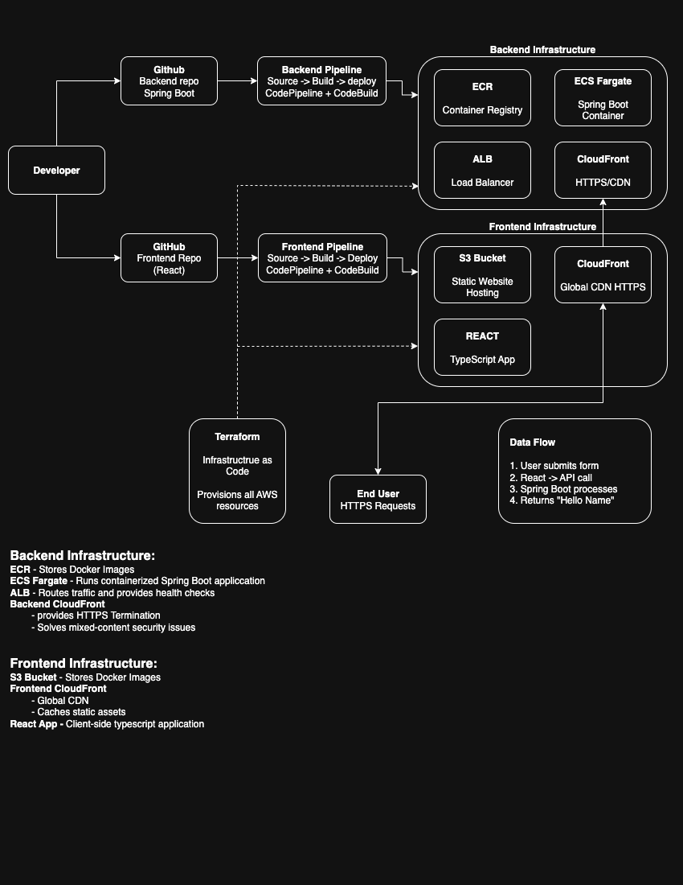

# Proof of Concept - Backend

## Overview

This proof of concept demonstrate

### System Architecture

This backend repository is part of a 3-repository system:

- ** [proof-of-concept-infrastructure](https://github.com/tsilvestri-slalom/proof-of-concept-infrastructure)** - Terraform IaC (deploy this FIRST)
- ** [proof-of-concept-backend](https://github.com/tsilvestri-slalom/proof-of-concept-backend)** ← **You are here** - Java Spring Boot API  
- ** [proof-of-concept-frontend](https://github.com/tsilvestri-slalom/proof-of-concept-frontend)** - React application




## Backend Repository Purpose

This repository contains a **minimal Java Spring Boot REST API** designed to demonstrate:

- **Simple API endpoint** that accepts a name and returns a greeting
- **Containerized deployment** using Docker and AWS ECS
- **Automated CI/CD** pipeline triggered on merge to `develop` branch
- **Health monitoring** and logging in AWS environment

**The application is intentionally simple** - the learning focus is on the deployment pipeline, not complex business logic.

## Prerequisites

- **Java 17** - Required for building and running locally
- **Maven 3.6+** - For dependency management (or use included wrapper)
- **Docker** - For containerization (optional for local development)
- **AWS CLI** - For deployment verification (optional)

## Quick Start

### 1. Clone and Setup
```bash
git clone https://github.com/tsilvestri-slalom/proof-of-concept-backend.git
cd proof-of-concept-backend
```

### 2. Run Locally
```bash
./mvnw spring-boot:run
```
Or, if you have docker setup:
```bash
docker-compose up --build
```

Application starts at: `http://localhost:8080`

### 3. Test the API
```bash
curl -X POST http://localhost:8080/hello \
  -H "Content-Type: application/json" \
  -d '{"name": "Tony"}'

# Response: {"message": "Hello, Tony"}
```

## API Documentation

### POST /hello

**Purpose**: Accept a name parameter and return a personalized greeting

**Request**:
```http
POST /hello
Content-Type: application/json

{
  "name": "string" (required)
}
```

**Response**:
```http
HTTP/1.1 200 OK
Content-Type: application/json

{
  "message": "Hello, [name]"
}
```

**Examples**:
```bash
# Valid request
curl -X POST http://localhost:8080/hello \
  -H "Content-Type: application/json" \
  -d '{"name": "Alice"}'
# Returns: {"message": "Hello, Alice"}

# Missing name (400 Bad Request)
curl -X POST http://localhost:8080/hello \
  -H "Content-Type: application/json" \
  -d '{}'
```

### Health Check Endpoint

**GET /actuator/health**
```bash
curl http://localhost:8080/actuator/health
# Returns: {"status": "UP"}
```

## Project Structure

```
proof-of-concept-backend/
├── src/
│   ├── main/
│   │   ├── java/com/example/hello_api/
│   │   │   ├── PocApplication.java              # Main application class
│   │   │   ├── controller/
│   │   │   │   └── HelloController.java         # REST endpoint
│   │   │   └── model/
│   │   │       ├── HelloRequest.java            # Request DTO
│   │   │       └── HelloResponse.java           # Response DTO
│   │   └── resources/
│   │       └── application.properties           # Configuration
│   └── test/
│       └── java/com/example/hello_api/
│           ├── PocApplicationTests.java         # Integration tests
│           └── controller/
│               └── HelloControllerTest.java     # Unit tests
├── Dockerfile                                   # Container configuration
├── buildspec.yml                               # AWS CodeBuild specification
├── pom.xml                                     # Maven dependencies
├── mvnw                                        # Maven wrapper script
└── README.md
```

## Local Development

### Building the Application
```bash
# Compile source code
./mvnw clean compile

# Run tests
./mvnw test

# Create executable JAR
./mvnw clean package

# Skip tests during build
./mvnw package -DskipTests
```

## Docker Development

### Build and Run Container
```bash
# Build Docker image
docker build -t poc-backend .

# Run container locally
docker run -p 8080:8080 poc-backend

# Run with environment variables
docker run -p 8080:8080 -e SERVER_PORT=8080 poc-backend
```

### Multi-stage Build
The Dockerfile uses multi-stage build for optimization:
1. **Build stage**: Compiles application with Maven
2. **Runtime stage**: Minimal JRE image with compiled JAR
3. **Result**: Smaller production image (~150MB vs ~500MB)

## Automated Deployment

### CI/CD Pipeline Trigger
The application automatically deploys when:
1. Changes are **merged to `develop` branch**
2. **GitHub webhook** notifies AWS CodePipeline
3. **CodeBuild project** starts automatically
4. **Docker image** is built and pushed to ECR
5. **ECS service** is updated with new image
6. **Health checks** verify successful deployment

### Build Process (buildspec.yml)
```yaml
version: 0.2

phases:
  install:
    runtime-versions:
      java: corretto17
  pre_build:
    commands:
      - echo Logging in to Amazon ECR...
      - aws ecr get-login-password --region $AWS_DEFAULT_REGION | docker login --username AWS --password-stdin $AWS_ACCOUNT_ID.dkr.ecr.$AWS_DEFAULT_REGION.amazonaws.com
  build:
    commands:
      - echo Build started on `date`
      - java -version
      - echo Building the Java application...
      - ./mvnw clean package -DskipTests
      - echo Building the Docker image...
      - docker build -t $IMAGE_REPO_NAME:$IMAGE_TAG .
      - docker tag $IMAGE_REPO_NAME:$IMAGE_TAG $AWS_ACCOUNT_ID.dkr.ecr.$AWS_DEFAULT_REGION.amazonaws.com/$IMAGE_REPO_NAME:$IMAGE_TAG
  post_build:
    commands:
      - echo Build completed on `date`
      - echo Pushing the Docker image...
      - docker push $AWS_ACCOUNT_ID.dkr.ecr.$AWS_DEFAULT_REGION.amazonaws.com/$IMAGE_REPO_NAME:$IMAGE_TAG
      - echo Writing image definitions file...
      - printf '[{"name":"%s-backend","imageUri":"%s"}]' "$PROJECT_NAME" "$AWS_ACCOUNT_ID.dkr.ecr.$AWS_DEFAULT_REGION.amazonaws.com/$IMAGE_REPO_NAME:$IMAGE_TAG" > imagedefinitions.json
      - cat imagedefinitions.json
artifacts:
  files:
    - imagedefinitions.json
```

### Deployment Verification
```bash
# Get backend URL from infrastructure
cd ../proof-of-concept-infrastructure
terraform output backend_api_url

# Test deployed API
curl -X POST https://your-alb-url.amazonaws.com/hello \
  -H "Content-Type: application/json" \
  -d '{"name": "Production"}'
```

## Configuration

### Application Properties
```properties
# Server configuration
server.port=8080
server.servlet.context-path=/

# Application settings
spring.application.name=proof-of-concept-backend
logging.level.com.example.poc=INFO

# Health check endpoints
management.endpoints.web.exposure.include=health,info
management.endpoint.health.show-details=when-authorized
```

### Environment Variables
The application supports these environment variables:

- `SERVER_PORT` - Override server port (default: 8080)
- `SPRING_PROFILES_ACTIVE` - Set active Spring profile
- `LOGGING_LEVEL_ROOT` - Set logging level (DEBUG, INFO, WARN, ERROR)

### AWS ECS Configuration
When deployed to ECS:
- **Container Port**: 8080
- **Health Check**: `/actuator/health`
- **Memory**: 512 MB (configurable in infrastructure)
- **CPU**: 256 CPU units (configurable in infrastructure)
- **Auto Scaling**: Based on CPU utilization

This backend serves as a foundation for learning CI/CD pipelines and containerized deployment. Keep the application simple and focused on demonstrating automated deployment practices rather than complex business logic.